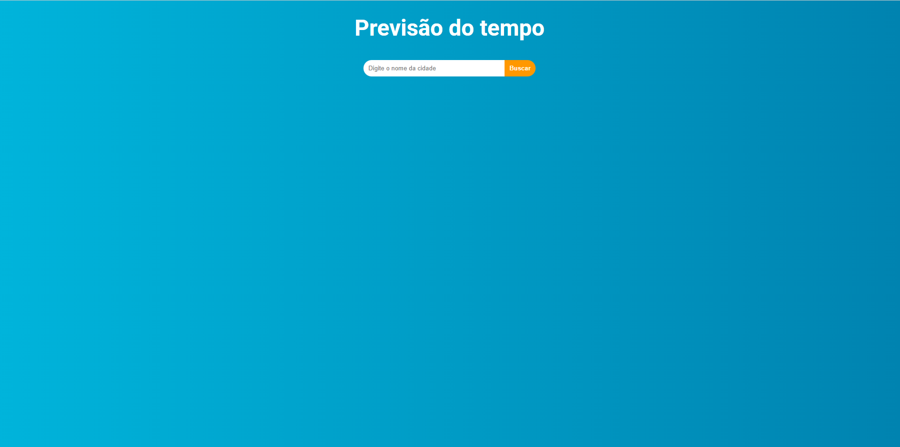
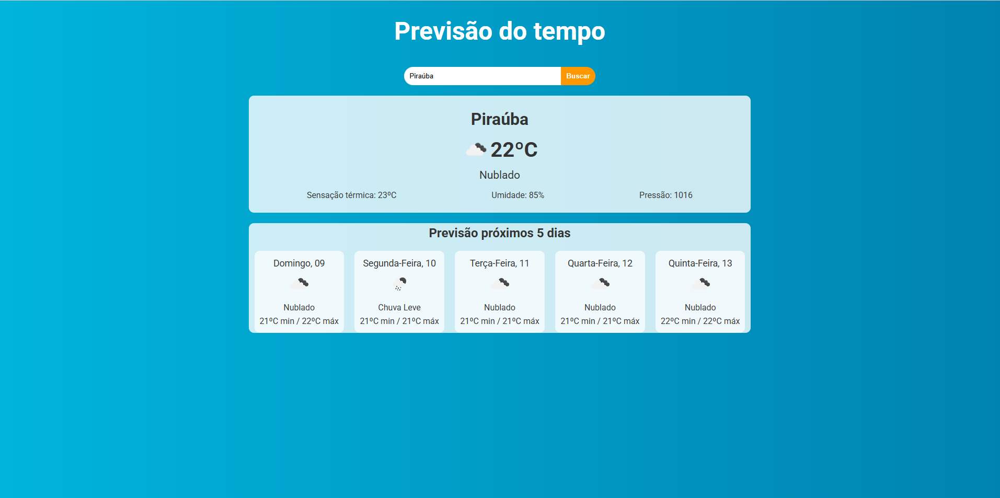

<h1 align="center">
     
</h1>

---

<h1 align="center">
     
</h1>

## 🏷️ Sobre 
**React-Previsao**: Desafio proposto no durante um vídeo do canal DevClub.
O desafio proposto era:
- [x] Buscar cidades através de um input
- [x] Consultar uma API através do valor do input
- [x] Conseguir destrinchar o retorno da API
- [x] Exibir as informações necessárias em tela através da consulta realizada
## ⚠️OBS

-  API utilizada: https://openweathermap.org/
---

## 🛠️ Tecnologias e serviços utilizados
Foram utilizadas as seguintes tecnologias para desenvolver a aplicação **React-Previsao** :

- [HTML5](https://html.com/)
- [React.js](https://pt-br.reactjs.org/)
- [Vite](https://www.vitetlang.org/)
- [OpenWeather](https://openweathermap.org/)

---

## 🗂️ Como baixar e iniciar o projeto 

```bash

    #clonar o projeto
    $ git clone https://github.com/joaopedrovidal/React-Previsao.git

    #entrar no diretório
    $ cd React-Previsao

    #instalar as dependências
    $ npm install

    #iniciar a aplicação
    $ npm run dev
```
### Servidor local
localhost:5173

---

## Autor
### 👤 João Pedro Vidal

- Linkedin: [@joaopedrovidal](https://www.linkedin.com/in/jo%C3%A3opedrovidaldossantos/)
- Github: [@joaopedrovidal](https://github.com/joaopedrovidal)
- Deploy: [...](...)

---
## 📝 Licença
Copyright © 2025 [@joaopedrovidal](...)

Este projeto está sobe a [LICENÇA MIT](https://opensource.org/licenses/MIT)

---

### Desenvolvido 💜 by João Pedro Vidal
